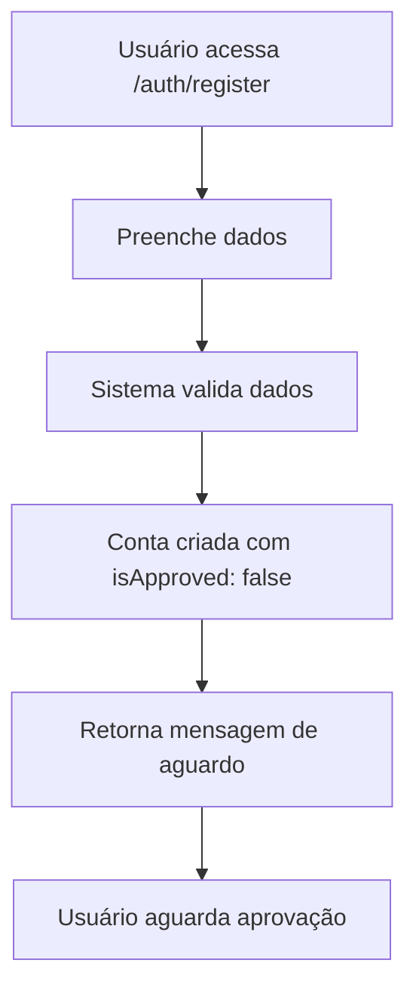
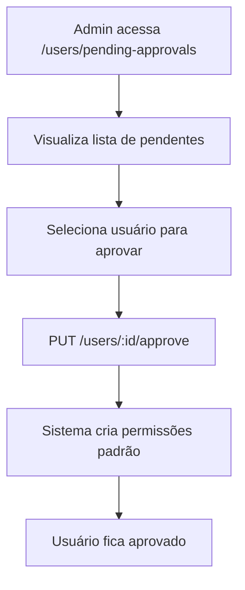
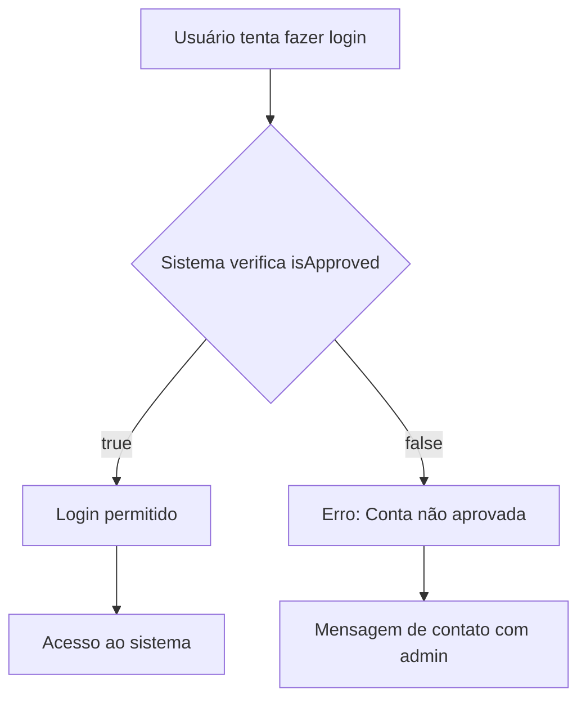

# Sistema de Gerenciamento de Login com Aprovação

## 🎯 Visão Geral

O sistema implementa um fluxo completo de gerenciamento de login com aprovação obrigatória de usuários. Após o cadastro, os usuários precisam ser aprovados por um administrador antes de poderem acessar o sistema.

## 🔄 Fluxo Completo do Sistema

### 1. **Cadastro do Usuário**


### 2. **Processo de Aprovação**


### 3. **Login e Acesso**


## 🔐 Autenticação e Autorização

### **Estrutura de Permissões**

#### **Níveis de Acesso:**
1. **Administradores** (`isAdmin: true`)
   - Acesso total ao sistema
   - Podem aprovar qualquer usuário
   - Podem gerenciar permissões

2. **Usuários Aprovados** (`isApproved: true`)
   - Acesso baseado em permissões específicas
   - Podem ter permissão de aprovação se configurado

3. **Usuários Pendentes** (`isApproved: false`)
   - Não podem fazer login
   - Não têm permissões no sistema

### **Permissões de Aprovação**
```typescript
// Módulo: users
// Recurso: user_approval
// Ações: read, write

// Exemplo de permissão
{
  module: "users",
  resource: "user_approval", 
  action: "write"
}
```

## 🛠️ Implementação Técnica

### **Campos no Banco de Dados**

```sql
-- Tabela users
ALTER TABLE "users" ADD COLUMN "isApproved" BOOLEAN NOT NULL DEFAULT false;
```

### **Validações no Login**

```typescript
// Verificação no AuthService
if (!user.isApproved) {
  throw new UnauthorizedException(
    'Conta ainda não foi aprovada. Entre em contato com o administrador.'
  );
}
```

### **Criação de Permissões Padrão**

```typescript
// Permissões criadas automaticamente na aprovação
const defaultPermissions = [
  { resource: 'financial_transactions', action: 'read' },
  { resource: 'financial_categories', action: 'read' },
  { resource: 'payment_methods', action: 'read' },
];
```

## 📋 Rotas do Sistema

### **Autenticação**

#### **POST /auth/register**
```json
{
  "email": "user@example.com",
  "password": "password123",
  "name": "Nome do Usuário"
}
```

**Resposta:**
```json
{
  "id": "user-id",
  "email": "user@example.com",
  "name": "Nome do Usuário",
  "isAdmin": false,
  "isApproved": false,
  "createdAt": "2025-07-30T20:26:37.000Z",
  "message": "Cadastro realizado com sucesso! Aguarde a aprovação de um administrador para acessar o sistema."
}
```

#### **POST /auth/login**
```json
{
  "email": "user@example.com",
  "password": "password123"
}
```

**Resposta (usuário aprovado):**
```json
{
  "access_token": "jwt-token",
  "user": {
    "id": "user-id",
    "email": "user@example.com",
    "name": "Nome do Usuário",
    "isAdmin": false,
    "isApproved": true
  }
}
```

**Erro (usuário não aprovado):**
```json
{
  "statusCode": 401,
  "message": "Conta ainda não foi aprovada. Entre em contato com o administrador.",
  "error": "Unauthorized"
}
```

### **Gerenciamento de Usuários**

#### **GET /users/pending-approvals**
Lista usuários pendentes de aprovação.

**Permissão:** `users:user_approval:read`

**Resposta:**
```json
[
  {
    "id": "user-id",
    "email": "user@example.com",
    "name": "Nome do Usuário",
    "isAdmin": false,
    "isApproved": false,
    "createdAt": "2025-07-30T20:26:37.000Z"
  }
]
```

#### **PUT /users/:id/approve**
Aprova ou rejeita um usuário.

**Permissão:** `users:user_approval:write`

**Request:**
```json
{
  "isApproved": true
}
```

**Resposta:**
```json
{
  "id": "user-id",
  "email": "user@example.com",
  "name": "Nome do Usuário",
  "isAdmin": false,
  "isApproved": true,
  "createdAt": "2025-07-30T20:26:37.000Z"
}
```

#### **GET /users**
Lista usuários com filtros.

**Query Parameters:**
- `isApproved` (boolean, opcional)
- `isAdmin` (boolean, opcional)

**Exemplo:**
```http
GET /users?isApproved=false&isAdmin=false
```

## 🔒 Segurança

### **Medidas Implementadas**

1. **Validação de Aprovação**
   - Verificação obrigatória no login
   - Usuários não aprovados não conseguem acessar

2. **Controle de Permissões**
   - Apenas admins ou usuários autorizados podem aprovar
   - Permissões específicas para gerenciamento de aprovação

3. **Isolamento de Dados**
   - Usuários não aprovados não têm permissões
   - Dados sensíveis protegidos por status de aprovação

4. **Auditoria**
   - Campo `isApproved` rastreável
   - Histórico de criação e aprovação

### **Boas Práticas**

1. **Sempre verificar `isApproved` antes de permitir acesso**
2. **Usar permissões específicas para aprovação**
3. **Manter logs de aprovações**
4. **Notificar usuários quando aprovados**

## 🚀 Como Usar

### **Para Administradores**

1. **Verificar usuários pendentes:**
   ```bash
   curl -X GET /users/pending-approvals \
     -H "Authorization: Bearer <admin-token>"
   ```

2. **Aprovar usuário:**
   ```bash
   curl -X PUT /users/:id/approve \
     -H "Authorization: Bearer <admin-token>" \
     -H "Content-Type: application/json" \
     -d '{"isApproved": true}'
   ```

3. **Configurar permissão de aprovação:**
   ```bash
   curl -X PUT /users/:id/permissions \
     -H "Authorization: Bearer <admin-token>" \
     -H "Content-Type: application/json" \
     -d '{
       "moduleId": "users-module-id",
       "permissions": [
         {
           "resource": "user_approval",
           "action": "write",
           "isActive": true
         }
       ]
     }'
   ```

### **Para Desenvolvedores**

1. **Verificar status de aprovação:**
   ```typescript
   const user = await this.authService.findById(userId);
   if (!user.isApproved) {
     throw new UnauthorizedException('Usuário não aprovado');
   }
   ```

2. **Criar middleware de verificação:**
   ```typescript
   @UseGuards(JwtAuthGuard, ApprovalGuard)
   async protectedRoute() {
     // Rota protegida
   }
   ```

## 📊 Monitoramento

### **Métricas Importantes**

1. **Usuários pendentes de aprovação**
2. **Tempo médio de aprovação**
3. **Taxa de rejeição de cadastros**
4. **Usuários ativos vs pendentes**

### **Logs Recomendados**

```typescript
// Log de tentativa de login não aprovado
logger.warn(`Tentativa de login não aprovado: ${email}`);

// Log de aprovação de usuário
logger.info(`Usuário aprovado: ${userId} por ${adminId}`);

// Log de rejeição de usuário
logger.info(`Usuário rejeitado: ${userId} por ${adminId}`);
```

## 🔧 Configuração

### **Variáveis de Ambiente**

```env
# Configurações de aprovação (opcional)
USER_APPROVAL_REQUIRED=true
DEFAULT_APPROVAL_PERMISSIONS=true
AUTO_APPROVE_ADMINS=false
```

### **Configurações de Permissões Padrão**

```typescript
// src/modules/users/users.service.ts
private async createDefaultPermissions(userId: string) {
  const defaultPermissions = [
    { resource: 'financial_transactions', action: 'read' },
    { resource: 'financial_categories', action: 'read' },
    { resource: 'payment_methods', action: 'read' },
  ];
  // Implementação...
}
```

## 🐛 Troubleshooting

### **Problemas Comuns**

1. **Usuário não consegue fazer login**
   - Verificar se `isApproved: true`
   - Verificar se credenciais estão corretas

2. **Erro de permissão na aprovação**
   - Verificar se usuário é admin
   - Verificar permissão `users:user_approval:write`

3. **Permissões não criadas na aprovação**
   - Verificar se módulo financeiro existe
   - Verificar logs de erro na criação

### **Comandos de Debug**

```bash
# Verificar usuários não aprovados
curl -X GET /users?isApproved=false

# Verificar permissões de um usuário
curl -X GET /users/:id/permissions

# Testar aprovação
curl -X PUT /users/:id/approve -d '{"isApproved": true}'
```

## 📈 Próximas Melhorias

1. **Notificação por Email**
   - Email automático quando usuário é aprovado
   - Email de lembrete para admins sobre pendências

2. **Histórico de Aprovações**
   - Tabela de logs de aprovações
   - Rastreamento de quem aprovou quando

3. **Configuração Flexível**
   - Permissões padrão configuráveis
   - Diferentes níveis de aprovação

4. **Expiração de Contas**
   - Auto-rejeição de contas antigas não aprovadas
   - Limpeza automática de dados

5. **Interface de Aprovação**
   - Dashboard para gerenciamento visual
   - Aprovação em lote

---

**Sistema de Gerenciamento de Login com Aprovação** - Versão 1.0  
*Implementado com segurança e flexibilidade para controle total de acesso ao sistema.*